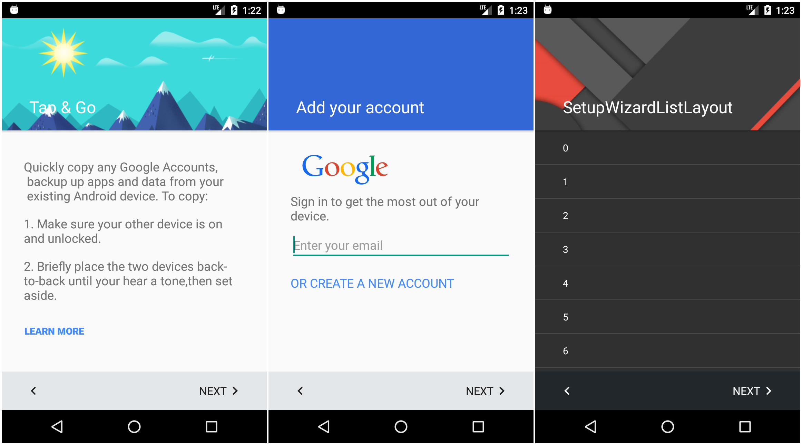

# SetupWizard
This repo reconfigured the old SetupWizard to work fine.

For you reference, the old things are below.

1. [SetupWizardLayout](https://github.com/iMeiji/SetupWizardLayout)
2. [AOSP SetupWizard](https://android.googlesource.com/platform/frameworks/opt/setupwizard/)

2. ## Screenshots

